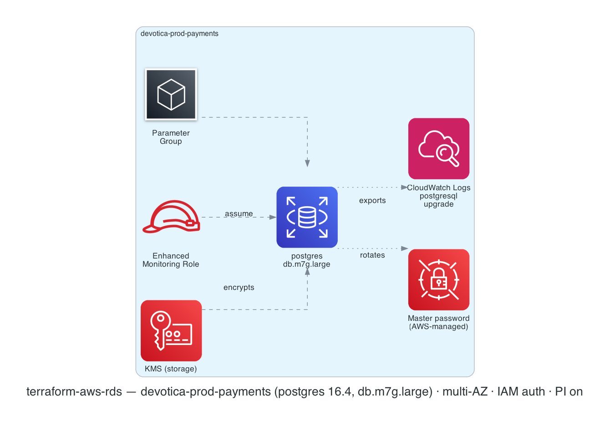

# terraform-aws-rds

[](https://github.com/devotica-labs/terraform-aws-rds/actions/workflows/ci.yml)
[](https://github.com/devotica-labs/terraform-aws-rds/actions/workflows/release.yml)
[](LICENSE)

Production-grade single-instance AWS RDS module with fintech-safe defaults. Encrypts storage with a caller-supplied KMS key (typically from [`terraform-aws-kms`](https://github.com/devotica-labs/terraform-aws-kms)), uses the AWS-managed master password via Secrets Manager, and refuses configurations that aren't fintech-compliant (`publicly_accessible = true`).

This module follows the Devotica module shape: Apache-2.0 licensed, validated inputs, plan-only unit + contract tests (mock-provider), terraform-docs auto-update, central reusable CI from `devotica-labs/terraform-shared-config`, and signed releases with CycloneDX SBOMs.

<!-- BEGIN_ARCH -->



<sub>Generated by `.github/workflows/architecture-diagram.yml` on every push to main. Do not edit the image by hand — change the Terraform code in `examples/complete/` and the bot will regenerate it.</sub>

<!-- END_ARCH -->

## Scope

| Surface | Covered |
|---|---|
| Single `aws_db_instance` (Postgres / MySQL / MariaDB) | ✅ |
| Storage encrypted with caller-supplied KMS key | ✅ (forced — no plaintext) |
| AWS-managed master password via Secrets Manager | ✅ (default) |
| IAM database authentication | ✅ (default on) |
| Multi-AZ | ✅ (default on) |
| Deletion protection | ✅ (default on) |
| Backup retention 7-35 days | ✅ |
| Enhanced monitoring (IAM role + AWS managed policy) | ✅ (opt-in via `monitoring_interval > 0`) |
| Performance Insights | ✅ (default on) |
| CloudWatch logs export | ✅ |
| Custom parameter group | ✅ (opt-in) |
| GP3 storage with optional IOPS + throughput | ✅ |
| Final snapshot with unique suffix | ✅ |
| `publicly_accessible = true` | ❌ (validation refuses) |
| Aurora cluster | ❌ (Aurora belongs in a sister module — single-instance Aurora is an antipattern) |
| Read replicas | ❌ (planned for v0.2) |
| Cross-region read replicas | ❌ (planned for v0.3) |
| Blue/Green deployments | ❌ (out of scope; AWS-console + state import flow) |

## Quick start

```hcl
module "rds" {
  source  = "devotica-labs/rds/aws"
  version = "~> 0.1"

  identifier     = "my-app-db"
  engine         = "postgres"        # default
  engine_version = "16.4"
  instance_class = "db.t4g.medium"

  allocated_storage     = 20
  max_allocated_storage = 100

  kms_key_arn = module.kms.key_arn   # from devotica-labs/terraform-aws-kms

  db_subnet_group_name   = aws_db_subnet_group.private.name
  vpc_security_group_ids = [aws_security_group.db.id]

  db_name = "myapp"

  tags = {
    Environment = "production"
    Project     = "my-app"
    Owner       = "platform@example.com"
    CostCenter  = "PLATFORM"
    ManagedBy   = "Terraform"
    Repo        = "https://github.com/your-org/your-infra"
  }
}
```

See [`examples/complete`](examples/complete/main.tf) for the full surface (gp3 + IOPS, 35-day backup retention, enhanced monitoring, custom parameter group with `pg_stat_statements`, CloudWatch logs export).

## Defaults that matter

- **`storage_encrypted = true`** — forced on by the module. Caller must supply `kms_key_arn`.
- **`manage_master_user_password = true`** — AWS RDS creates the master password in Secrets Manager and rotates it automatically. Caller never sees the plaintext. To opt out, set this to `false` and pass `master_password` (sensitive variable).
- **`iam_database_authentication_enabled = true`** — passwordless DB access for IAM principals (typically an ECS task role + the database resource ID condition).
- **`multi_az = true`** — HA in fintech is non-negotiable. Override to `false` for sandbox.
- **`deletion_protection = true`** — blocks `terraform destroy` and AWS-console delete. Override to `false` for a planned teardown.
- **`skip_final_snapshot = false`** — the safety net for accidental destroy.
- **`publicly_accessible`** — validation **refuses** `true`. RDS in fintech must be VPC-internal only.
- **`backup_retention_period = 7`** — RBI / SEBI floor. Increase up to 35 (the AWS max) for stricter audit retention.
- **`performance_insights_enabled = true`** with 7-day free retention.
- **Tags**: every taggable resource gets `ManagedBy = "terraform"` and `Module = "terraform-aws-rds"` merged with `var.tags`.

## How this fits the Devotica catalog

```
terraform-aws-kms              terraform-aws-vpc              terraform-aws-iam
       │                              │                              │
       │ key_arn                      │ private subnet ids           │ task role arn (for IAM DB auth)
       ▼                              ▼                              ▼
                              terraform-aws-rds
```

Typical wiring in a `sample-infra`-style consumer:

```hcl
module "kms" { source = "devotica-labs/kms/aws" ... }
module "vpc" { source = "devotica-labs/vpc/aws" ... }

resource "aws_db_subnet_group" "private" {
  subnet_ids = module.vpc.private_subnet_ids
  ...
}

resource "aws_security_group" "db" {
  vpc_id = module.vpc.vpc_id
  # ingress from app SGs only
  ...
}

module "rds" {
  source                 = "devotica-labs/rds/aws"
  kms_key_arn            = module.kms.key_arn
  db_subnet_group_name   = aws_db_subnet_group.private.name
  vpc_security_group_ids = [aws_security_group.db.id]
  ...
}
```

## Common usage patterns

**Postgres with IAM database authentication only** (no master password traffic to apps):

```hcl
manage_master_user_password         = false
master_password                     = "" # never actually used because:
iam_database_authentication_enabled = true
```

Apps then connect using `aws rds generate-db-auth-token` against the resource ID. Pair with a terraform-aws-iam role that grants `rds-db:connect` on `arn:aws:rds-db:<region>:<account>:dbuser:<resource_id>/<db_user>`.

**MySQL with audit logging**:

```hcl
engine                          = "mysql"
engine_version                  = "8.0.39"
enabled_cloudwatch_logs_exports = ["audit", "error", "general", "slowquery"]
```

**Provisioned IOPS for a write-heavy workload**:

```hcl
storage_type       = "gp3"
allocated_storage  = 200
iops               = 16000
storage_throughput = 1000
```

## Governance

- CI runs the central reusable workflow from `devotica-labs/terraform-shared-config`: fmt, validate, tflint, tfsec, gitleaks, terraform-docs, conftest against `devotica-labs/terraform-policies`, terraform test, checkov, examples build.
- Releases are cut by `release-please` on Conventional Commits. Each release is keyless-signed via cosign and ships a CycloneDX SBOM.

<!-- BEGIN_TF_DOCS -->
<!-- terraform-docs will inject the inputs/outputs/resources tables here on the next CI run -->
<!-- END_TF_DOCS -->

## License

Apache-2.0. See [`LICENSE`](LICENSE) and [`NOTICE`](NOTICE).
